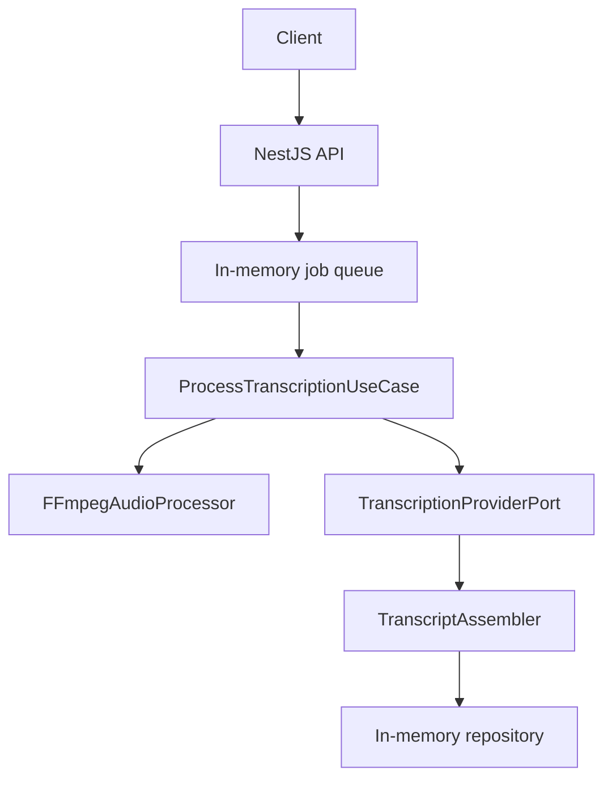
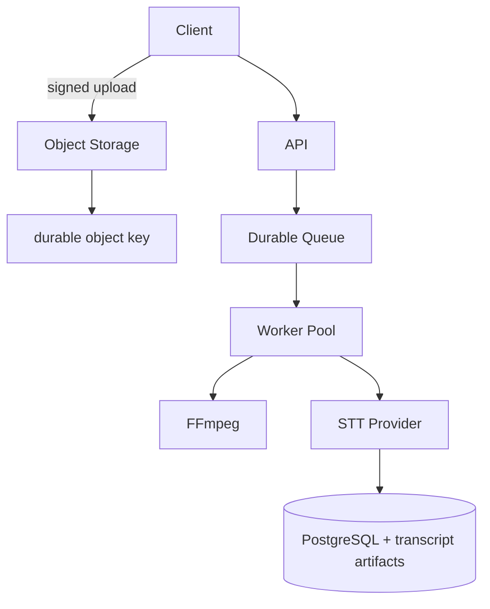

# Audio Transcription Pipeline

Async NestJS service that accepts audio uploads, normalizes them with FFmpeg, transcribes speech through Groq Whisper (or a deterministic mock provider), and returns provider-independent timestamped segments.

```text
audio upload
  → async job (202 Accepted)
  → FFmpeg inspect + normalize (+ chunk if long)
  → Groq / Mock provider
  → timestamp offset + assemble
  → transcript result
```

## Architecture



Clean Architecture is applied pragmatically:

| Layer | Responsibility |
| --- | --- |
| Presentation | HTTP, Multer uploads, Swagger DTOs |
| Application | Create/get/process use cases, retry, transcript assembly |
| Domain contracts | Job model + ports (`TranscriptionProvider`, `AudioProcessor`, `Repository`, `JobQueue`) |
| Infrastructure | Groq/Mock, FFmpeg, in-memory repo/queue |

Framework concerns stay at the edges. Groq response shapes never leave the Groq adapter.

## Technology Decisions

### TypeScript / Node.js 24

This service is orchestration: HTTP, async jobs, provider I/O, and file processing. Node.js is a good fit for that coordination work. It does **not** run the ML model itself.

### NestJS

Chosen for DI, modules, validation, structured exceptions, testability, and first-class Swagger. That combination keeps the assessment focused without inventing a mini-framework.

### Express adapter

Nest’s Multer integration is straightforward on the default Express adapter. This is a pragmatic choice for multipart uploads—not a claim that Express is universally better than Fastify.

### FFmpeg / ffprobe

Codec handling is isolated from the STT provider. Incoming MP3/WAV/M4A/MP4/WebM/OGG/FLAC is inspected and normalized to mono 16 kHz PCM WAV before transcription.

### Groq Whisper Large V3 Turbo

I selected Groq-hosted Whisper Large V3 Turbo because the exercise requires real speech transcription with timestamped segments, while Groq's Free Plan makes the implementation practical to test during the assessment.

The provider is isolated behind `TranscriptionProviderPort`. Groq-specific response structures are translated at the infrastructure boundary, so the application does not depend on Groq.

Precise speech timing cannot reliably be inferred from plain transcript text. It must originate from either an STT engine or a separate alignment system. In this implementation Whisper provides initial segment-relative timing, while chunk offsets, normalization, ordering and result assembly remain application responsibilities.

Production provider selection would additionally consider accuracy, latency, cost, rate limits, privacy, data residency, availability and operational complexity.

The Free Plan is useful for development/testing. It is not presented as universally free.

## Timestamp Design

```text
Provider responsibility:
  audio → recognized speech + relative timing

Application responsibility:
  relative timing + chunk offset
  → absolute timing
  → ordered / merged transcript
```

Example:

```text
chunk offset = 598s
provider segment = [3.5, 7.1]
absolute segment = [601.5, 605.1]
```

This preserves provider independence: any STT that returns relative segments can plug into the same assembler.

## Running Locally

Prerequisites:

- Node.js 24 LTS
- npm
- FFmpeg + ffprobe on `PATH`

```bash
npm install
cp .env.example .env
npm run samples:generate   # optional synthetic WAV/MP3
npm run start:dev
```

Default mode is mock and needs **no credentials**:

```env
TRANSCRIPTION_PROVIDER=mock
```

API docs: [http://localhost:3000/docs](http://localhost:3000/docs)

## Running Groq Mode

```bash
cp .env.example .env
```

Set:

```env
TRANSCRIPTION_PROVIDER=groq
GROQ_API_KEY=<your key>
TRANSCRIPTION_MODEL=whisper-large-v3-turbo
```

Startup fails clearly if Groq is selected without an API key.

```bash
npm run start:dev
```

Upload a short WAV/MP3 via Swagger (`/docs`) or:

```bash
curl -X POST http://localhost:3000/v1/transcriptions \
  -H "Idempotency-Key: $(uuidgen)" \
  -F "file=@./samples/sample.wav"

curl http://localhost:3000/v1/transcriptions/<id>
```

Automated tests never call Groq.

## API Usage

### Health

```bash
curl http://localhost:3000/health
```

### Create transcription

```bash
curl -X POST http://localhost:3000/v1/transcriptions \
  -H "Idempotency-Key: $(uuidgen)" \
  -F "file=@./samples/sample.wav"
```

```json
{ "id": "...", "status": "QUEUED" }
```

Required header: `Idempotency-Key` (UUID v4). Reusing the same key returns the existing job.

### Poll transcription

```bash
curl http://localhost:3000/v1/transcriptions/<id>
```

Statuses: `QUEUED` → `PROCESSING` → `COMPLETED` | `FAILED`.

Completed responses include application-owned timestamped segments.

## Audio Formats

```text
incoming format
    ↓
FFmpeg / ffprobe validation + normalize
    ↓
mono 16 kHz WAV/PCM
    ↓
STT provider
```

Filename extensions are not trusted alone. Corrupt or non-audio uploads fail before the provider is called when possible.

## Long Audio

Configured by:

```env
AUDIO_CHUNK_DURATION_SECONDS=600
AUDIO_CHUNK_OVERLAP_SECONDS=2
```

Flow:

1. Normalize whole input
2. Inspect duration
3. Short audio → single provider call
4. Long audio → overlapped chunks with `offsetSeconds`
5. Transcribe each chunk (chunk-level retry via shared retry policy)
6. Convert relative timestamps to absolute
7. Merge + simple overlap dedupe

Overlap handling is intentionally simple and deterministic: obvious duplicate text entirely inside an overlap window is dropped; ambiguous speech is retained. Perfect NLP-style deduplication is a documented trade-off, not a hidden feature.

Chunks are transcribed sequentially in this assessment to keep resource usage predictable. Parallel chunk transcription is a straightforward future tuning knob.

## Concurrency

Assessment:

```text
bounded in-process queue (TRANSCRIPTION_CONCURRENCY)
```

Uploads return immediately (`202`). At most N jobs process at once; excess jobs remain `QUEUED`. That is backpressure without Redis.

Production:

```text
durable distributed queue + independent worker pool
```

Examples: AWS SQS, Google Pub/Sub, BullMQ + Redis, RabbitMQ—chosen to match the deployment environment. That enables independent API/worker scaling, crash recovery, durable retries, and DLQs.

## Retry / Recovery

```env
TRANSCRIPTION_MAX_RETRIES=3
TRANSCRIPTION_RETRY_BASE_DELAY_MS=500
```

- Retry: HTTP 429/5xx, timeouts, connection resets, other transient provider errors
- Prefer provider `Retry-After` when present
- Exponential backoff + small jitter
- Do **not** retry auth failures, bad requests, unsupported/corrupt media
- Exhausted retries → `FAILED` with a safe message
- No silent Groq → mock fallback

Chunk transcription is isolated so successful chunks need not be re-run if chunk-level recovery is extended later.

Idempotency for client retries is required via `Idempotency-Key` (UUID v4). Production systems may also use upload hashes or uniqueness constraints.

## Storage

### Assessment (intentionally non-durable)

```text
uploaded audio     → temporary filesystem (/tmp/transcription/<jobId>)
job metadata       → in-memory repository
completed process  → temporary audio deleted in finally
```

Restarting the process loses jobs. That is deliberate for this assignment.

### Production recommendation

- **Audio**: object storage (S3 / GCS / Azure Blob), not a relational DB
- **Metadata**: PostgreSQL (job id, status, storage key, duration, provider/model, timestamps, failure metadata)
- **Transcripts**: JSONB for normal size; object storage for very large artifacts
- Lifecycle/retention policies for audio and transcripts

At higher scale, prefer signed direct-to-object-storage uploads so API nodes do not proxy large binaries:

```text
Client → signed URL → S3/GCS → submit storage key → queue job
```

## Production Architecture



Production concerns intentionally not implemented here: independent API/worker autoscaling, durable retries/DLQ, authn/z, quotas, encryption, observability platforms, and retention automation.

## Trade-Offs (Deliberately Not Implemented)

These are production evolutions, not missing bugs:

- persistent database
- distributed queue
- object storage / signed uploads
- authentication / authorization
- Kubernetes
- full metrics/tracing stack
- local ML runtime
- forced alignment service
- complex overlap NLP

The goal is the smallest clean solution that proves the architecture.

## Security Considerations

- Credentials only via env/secret manager (never committed)
- Upload validation via ffprobe + size limits
- Temporary file cleanup even on failure
- Safe HTTP errors (no stack traces, keys, or raw provider payloads)
- Helmet enabled
- Production should add authn/z, rate limits, tenant quotas, malware/media scanning where appropriate, encryption in transit/at rest, and retention aligned with privacy/data-residency needs

## Testing

```bash
npm test
npm run test:e2e
npm run test:cov
```

Coverage includes:

- use cases and status transitions
- retry policy (transient vs permanent)
- timestamp offsets, multi-chunk assembly, ordering, overlap
- mock provider determinism
- Groq adapter mapping isolation
- bounded queue concurrency
- API/e2e happy path + validation failures

All automated tests force `TRANSCRIPTION_PROVIDER=mock`.

## Docker

```bash
cp .env.example .env
docker build -t transcription-pipeline .
docker run --rm -p 3000:3000 --env-file .env transcription-pipeline
```

The image installs FFmpeg. Mock mode runs without Groq credentials.

## Future Improvements

Reasonable evolutions (not incomplete work):

- S3/GCS storage + PostgreSQL repository
- durable queue / worker pool
- webhook or SSE/WebSocket completion events
- speaker diarization / word-level timestamps
- language hints and richer language detection options
- VAD-aware chunking
- `WhisperCppTranscriptionProvider` for privacy/offline/self-hosted needs
- `TranscriptAlignmentPort` when an STT returns text without timing
- metrics/tracing, multi-provider fallback policy, tenant quotas, cost controls

### Why a future local STT might exist

Local inference (for example whisper.cpp behind the same port) can be justified by privacy, data residency, offline processing, provider independence, or volume economics. Trade-offs include CPU/GPU needs, model distribution, scaling, ops complexity, latency, container size, native dependencies, and model upgrades. Local is not automatically superior.

### Future alignment port

If a provider returns good text without timestamps:

```ts
interface TranscriptAlignmentPort {
  align(audioPath: string, transcript: string): Promise<TranscriptionSegment[]>;
}
```

That remains a documented evolution path only.

## Observability (Production Discussion)

Useful metrics: upload count, queue depth/wait, transcription duration, audio duration, processing ratio, success/failure rates, provider latency/error rate, retries, chunk count, cost per audio minute.

Example trace shape: request → upload → queue → worker → FFmpeg → provider → persistence.
